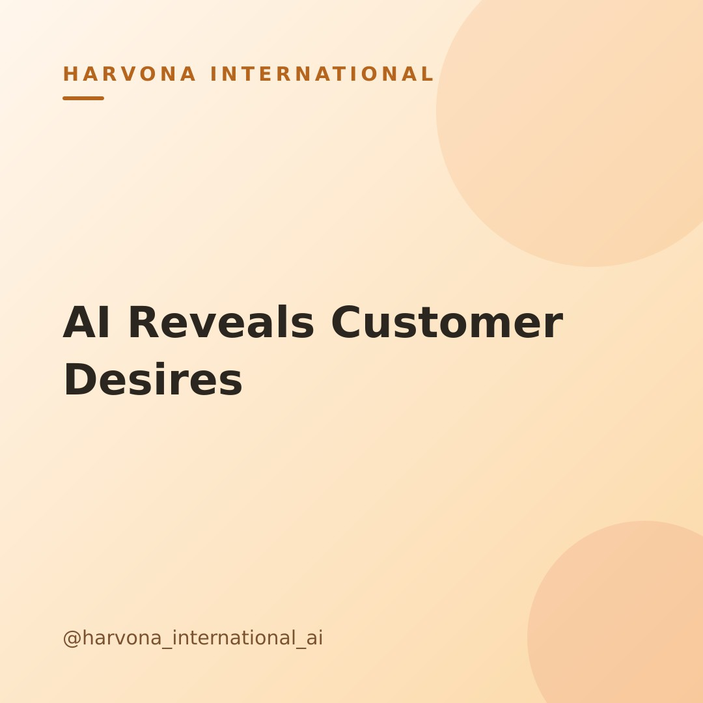

# Draft post — 2026-07-01-0116

**Topic:** How to use AI to understand your customers and what they actually want

## Caption

Ever feel like you're guessing what your customers *really* want? It's tough to keep up with feedback from every channel, from DMs to reviews to survey responses. But what if there was a way to make sense of it all without spending hours sifting through text?

This is where AI shines! You can use AI tools to quickly analyze customer conversations, reviews, and survey data. It can spot trends, common pain points, and even emerging desires that might be hidden in plain sight. Think of it as having a super-powered assistant that reads between the lines for you. 🧠

Instead of manual analysis, feed your customer comments into an AI tool to get summaries of key themes. This helps your lean team focus on what truly matters to your audience, ensuring your products and messages hit the mark every time.

What's one question you wish you could ask your customers and get an instant, clear answer to?

#customerinsights #aiformarketing #smallbusinesstips #founderlife #marketingstrategy #aiforsmallbusiness #knowyourcustomer #digitalmarketing #businesstools #marketresearch #growyourbusiness #leanmarketing

---
_Merge this PR to approve and publish. Close it to reject._
